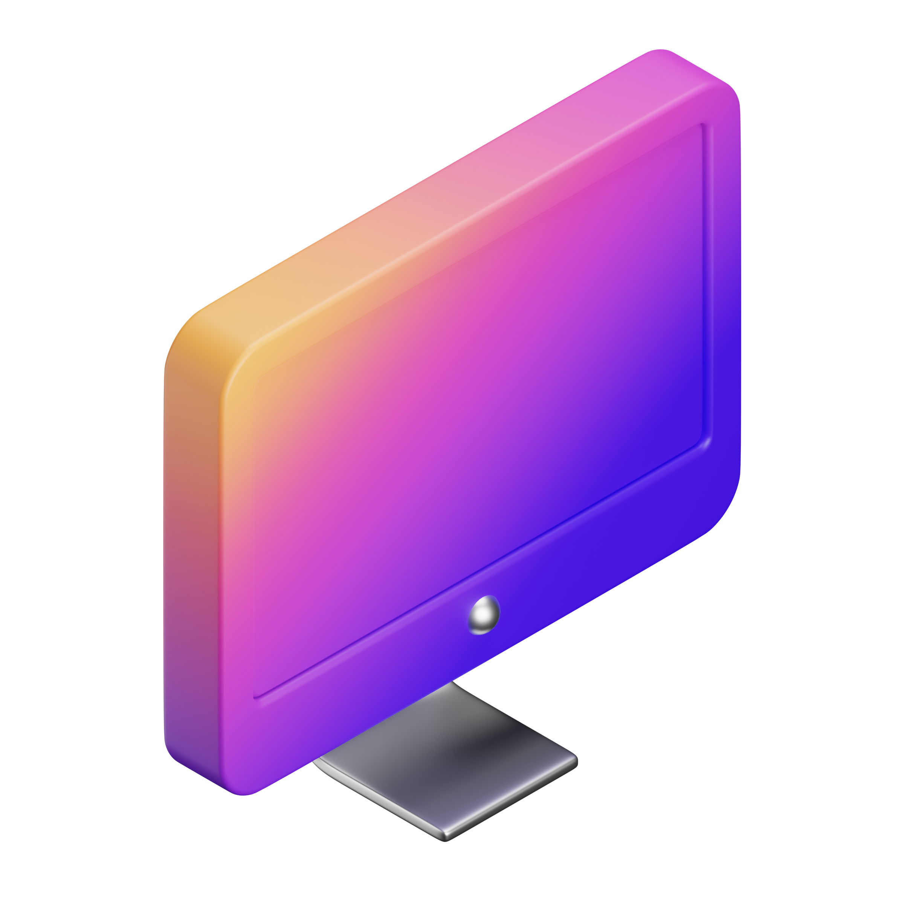

 
Hello World! My name is <strong>Gabriel Sena</strong> and I love solving problems through code. 

I'm always studying <strong>backend</strong> and <strong>frontend</strong> web development looking to build more and more complete and sophisticated applications.

---

### :gear: Tools 

<!---  --->
  
